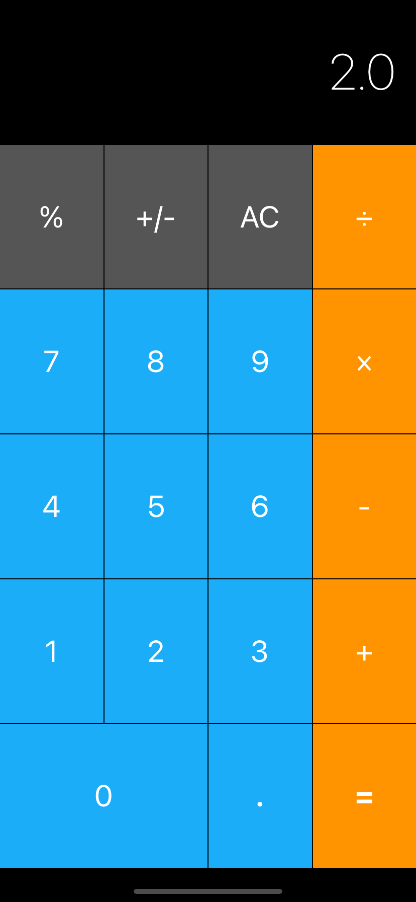
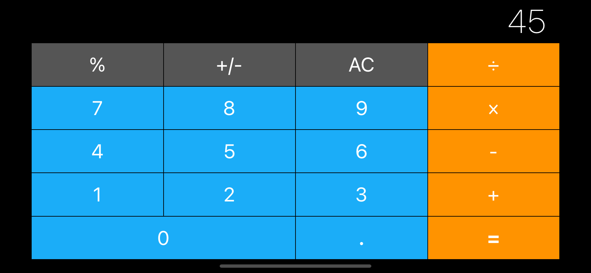

# Calculator App With Swift And Storyboard





Simple iOS calculator by [@Ifechukwudaniel](https://github.com/Ifechukwudaniel)

### Usage

1.  Download the repository

```
$ git clone git@github.com:Ifechukwudaniel/SwiftCalculator.git
$ cd SwiftCalculator
```

2.  Open the project in Xcode

```
$ open Calculator Layout iOS13.xcodeproj
```

3. Ruse the run the app

### Requirements

- Xcode 6.3
- iOS 8

### Credits

- [@Ifechukwudaniel](https://github.com/Ifechukwudaniel) for most of the application
- [appbrewery](https://github.com/appbrewery) inital setup and storyboard
